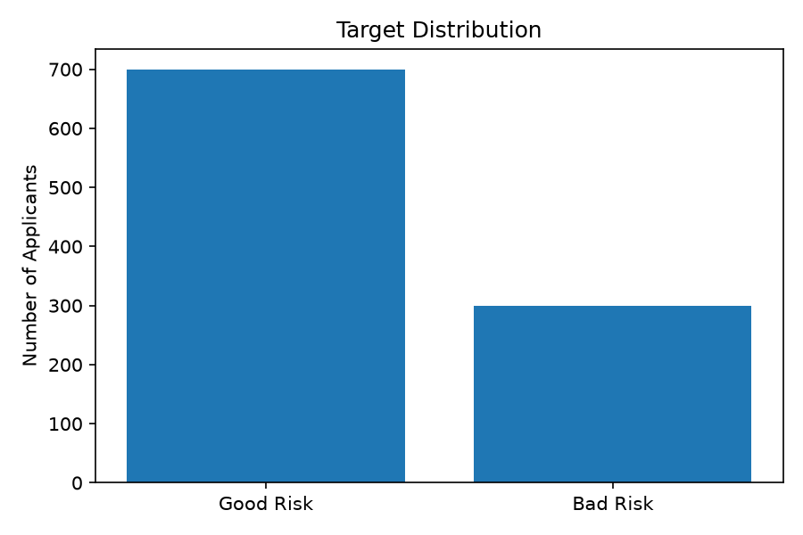
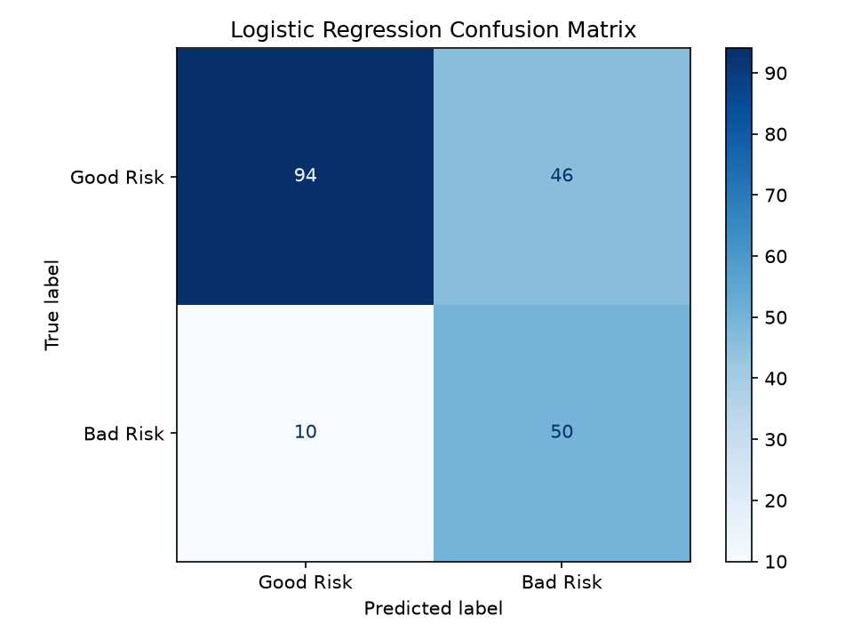
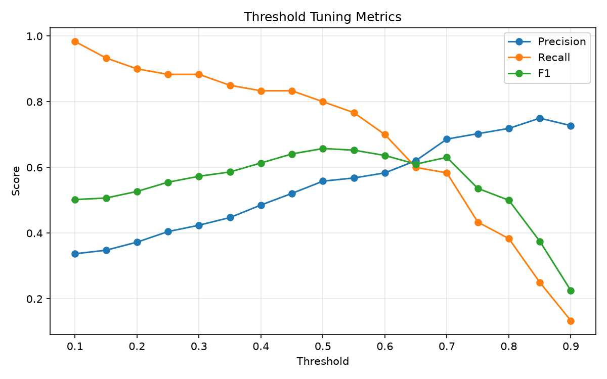
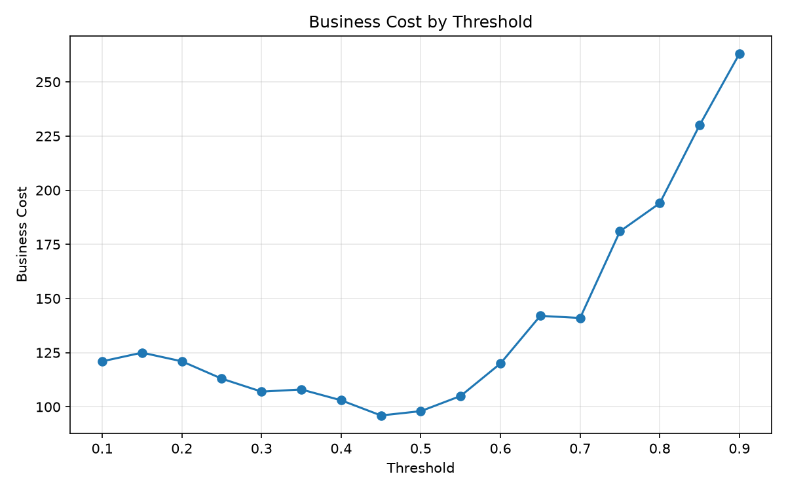

# Credit Risk Scoring Baseline

This project builds a baseline machine learning model for credit risk scoring using the UCI Statlog German Credit Data.

The goal is to predict whether a loan applicant is a good or bad credit risk, then evaluate the model using both standard ML metrics and the dataset's business cost matrix.

## Dataset

Source: UCI Statlog German Credit Data  
Link: https://archive.ics.uci.edu/dataset/144/statlog+german+credit+data

The dataset contains:

- 1000 samples
- 20 input features
- No missing values
- Binary target

Original target:

- 1 = good credit risk
- 2 = bad credit risk

For modeling, the target is remapped to:

- bad_risk = 0: good credit risk
- bad_risk = 1: bad credit risk

Target distribution:

- Good risk: 700 samples, 70%
- Bad risk: 300 samples, 30%



## Business Context

The dataset provides a cost matrix.

False Positive:

- Actual good risk
- Predicted bad risk
- Cost = 1

False Negative:

- Actual bad risk
- Predicted good risk
- Cost = 5

In this project, false negatives are more expensive because the model would approve or classify a risky applicant as good risk.

Business cost formula:

```text
business_cost = FP * 1 + FN * 5
```

## Features

The original dataset uses generic column names such as Attribute1, Attribute2, etc.

These columns are renamed into more interpretable names.

Examples:

- Attribute1 -> checking_account_status
- Attribute2 -> duration_months
- Attribute3 -> credit_history
- Attribute4 -> purpose
- Attribute5 -> credit_amount
- Attribute13 -> age
- Attribute20 -> foreign_worker

The features describe applicant and loan information such as checking account status, loan duration, credit history, purpose, credit amount, savings, employment, age, housing, job, and foreign worker status.

## Models

Two baseline models are trained:

- Logistic Regression
- Random Forest

Both models use a preprocessing pipeline:

- Numeric features: StandardScaler
- Categorical features: OneHotEncoder
- Class imbalance handling: class_weight="balanced"

## Baseline Results

Test set size: 200 samples.

Logistic Regression:

- Accuracy: 0.750
- Precision: 0.558
- Recall: 0.800
- F1: 0.658
- ROC-AUC: 0.806
- PR-AUC: 0.633
- Confusion matrix: TN=102, FP=38, FN=12, TP=48



Random Forest:

- Accuracy: 0.705
- Precision: 0.506
- Recall: 0.750
- F1: 0.604
- ROC-AUC: 0.790
- PR-AUC: 0.609
- Confusion matrix: TN=96, FP=44, FN=15, TP=45

Logistic Regression performs better than Random Forest on this baseline split across most metrics.

## Cross-Validation

A 5-fold stratified cross-validation is also run for Logistic Regression.

Mean scores:

- Accuracy: 0.719
- Precision: 0.524
- Recall: 0.720
- F1: 0.606
- ROC-AUC: 0.786
- PR-AUC: 0.610

This provides a more stable estimate than relying only on a single train/test split.

## Key Takeaways

- Logistic Regression is the strongest baseline model in this project.
- The model reaches 0.806 ROC-AUC and 0.633 PR-AUC on the test set.
- Using the dataset cost matrix, threshold 0.45 gives the lowest business cost.
- False negatives are more expensive than false positives, so recall is important.
- Cross-validation shows the model performance is reasonable but not perfect, which is expected for a real dataset.

## Threshold Tuning

The default threshold is 0.50.

Because false negatives are more expensive, thresholds from 0.10 to 0.90 are tested using the business cost formula.

Best threshold by business cost:

- Threshold: 0.45
- Precision: 0.521
- Recall: 0.833
- F1: 0.641
- FP: 46
- FN: 10
- Business cost: 96

Default threshold 0.50:

- Precision: 0.558
- Recall: 0.800
- F1: 0.658
- FP: 38
- FN: 12
- Business cost: 98

Under the provided cost matrix, threshold 0.45 achieves the lowest business cost on the test set.





## Model Interpretation

Logistic Regression coefficients are used for basic interpretation.

Positive coefficients increase the predicted probability of bad_risk = 1.  
Negative coefficients decrease the predicted probability of bad_risk = 1.

Top features increasing bad risk:

- purpose_A46: 0.959
- property_A124: 0.635
- checking_account_status_A11: 0.621
- credit_history_A30: 0.590
- savings_account_A61: 0.585
- purpose_A45: 0.573
- foreign_worker_A201: 0.568
- purpose_A40: 0.488
- housing_A151: 0.460
- other_installment_plans_A141: 0.428

Top features decreasing bad risk:

- checking_account_status_A14: -0.987
- purpose_A41: -0.887
- credit_history_A34: -0.852
- savings_account_A64: -0.677
- foreign_worker_A202: -0.651
- employment_since_A74: -0.595
- purpose_A410: -0.589
- personal_status_sex_A93: -0.536
- housing_A153: -0.506
- other_debtors_A103: -0.452

These coefficients describe associations learned by the fitted Logistic Regression model. They should not be interpreted as causal effects.

## How To Run

Create a virtual environment:

```powershell
python -m venv .venv
```

Install dependencies:

```powershell
.\.venv\Scripts\python.exe -m pip install -r requirements.txt
```

Run data loading:

```powershell
$env:PYTHONPATH="src"
.\.venv\Scripts\python.exe -m credit_risk.load_data
```

Run baseline training:

```powershell
$env:PYTHONPATH="src"
.\.venv\Scripts\python.exe -m credit_risk.train_baseline
```

Run threshold tuning:

```powershell
$env:PYTHONPATH="src"
.\.venv\Scripts\python.exe -m credit_risk.threshold_tuning
```

Run model interpretation:

```powershell
$env:PYTHONPATH="src"
.\.venv\Scripts\python.exe -m credit_risk.interpret_model
```

Generate model summary:

```powershell
$env:PYTHONPATH="src"
.\.venv\Scripts\python.exe -m credit_risk.model_summary
```

Save trained model:

```powershell
$env:PYTHONPATH="src"
.\.venv\Scripts\python.exe -m credit_risk.save_model

## API Usage

Run the FastAPI server:

```powershell
.\run_api.bat
```

Open API docs:

```text
http://127.0.0.1:8000/docs
```

Health check:

```text
GET /health
```

Prediction endpoint:

```text
POST /predict
```

Example request:

```json
{
  "checking_account_status": "A11",
  "duration_months": 24,
  "credit_history": "A32",
  "purpose": "A40",
  "credit_amount": 5000,
  "savings_account": "A61",
  "employment_since": "A72",
  "installment_rate": 4,
  "personal_status_sex": "A93",
  "other_debtors": "A101",
  "residence_since": 2,
  "property": "A123",
  "age": 30,
  "other_installment_plans": "A143",
  "housing": "A152",
  "existing_credits": 1,
  "job": "A173",
  "dependents": 1,
  "telephone": "A191",
  "foreign_worker": "A201"
}
```

Example response:

```json
{
  "bad_risk_probability": 0.8854,
  "threshold": 0.45,
  "prediction": 1,
  "risk_label": "bad_risk"
}
```

## Project Structure

```text
credit-risk-scoring-baseline/
  data/
  models/
  notebooks/
  reports/
  src/
    credit_risk/
      load_data.py
      train_baseline.py
      threshold_tuning.py
      interpret_model.py
      model_summary.py
  README.md
  requirements.txt
```

## Next Steps

Potential improvements:

- Add cross-validation
- Compare more models
- Tune hyperparameters
- Save the trained model
- Add visualizations
- Build a small prediction API with FastAPI